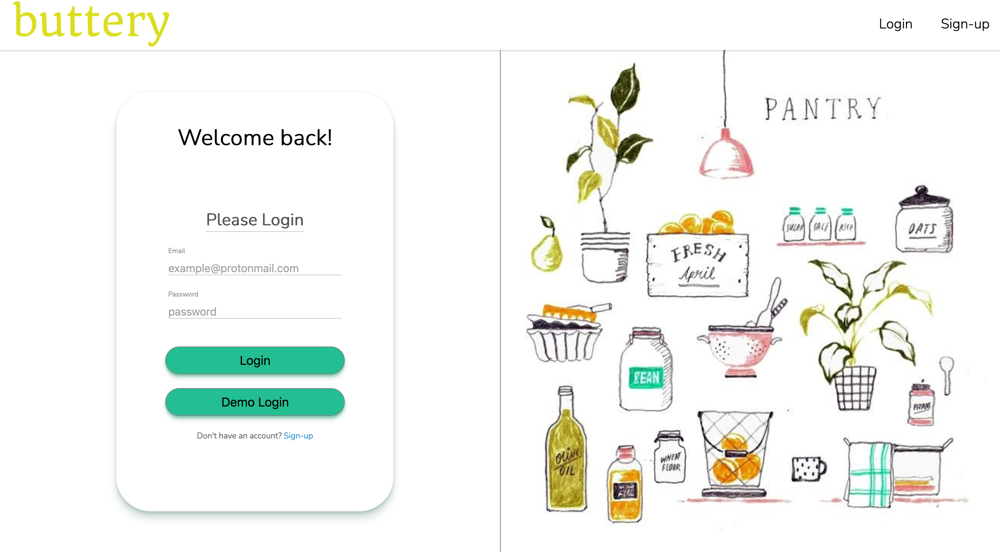

<!--
*** Thanks for checking out the Best-README-Template. If you have a suggestion
*** that would make this better, please fork the repo and create a pull request
*** or simply open an issue with the tag "enhancement".
*** Thanks again! Now go create something AMAZING! :D
***
***
***
*** To avoid retyping too much info. Do a search and replace for the following:
*** github_username, buttery, twitter_handle, email, project_title, project_description
-->

<!-- PROJECT SHIELDS -->
<!--
*** I'm using markdown "reference style" links for readability.
*** Reference links are enclosed in brackets [ ] instead of parentheses ( ).
*** See the bottom of this document for the declaration of the reference variables
*** for contributors-url, forks-url, etc. This is an optional, concise syntax you may use.
*** https://www.markdownguide.org/basic-syntax/#reference-style-links
-->
<!-- [![Contributors][contributors-shield]][contributors-url] -->
<!-- [![Forks][forks-shield]][forks-url] -->

<!-- [![Stargazers][stars-shield]][stars-url] -->
<!-- [![Issues][issues-shield]][issues-url] -->
<!-- [![MIT License][license-shield]][license-url] -->
[![LinkedIn][linkedin-shield]][linkedin-url]

<!-- PROJECT LOGO -->

<!-- <br /> -->
<p align="center">
  <a href="https://github.com/michael-gann/buttery">
    
  </a>

  <h3 align="center">buttery</h3>

  <p align="center">
    buttery lets you add your own recipes and create a virtual pantry to keep
    track of your pantry's ingredients. You can add recipes you want to make to
    your cooking list and receive a shopping list of items needed based off of
    your pantry stock. You can mark a recip as "shop" to add missing
    ingredients to a shopping list or, if you have the required ingredients,
    mark a recipe as 'cooked' to deduct the ingredients from your pantry.
    <br />
    <!-- <a href="https://github.com/michael-gann/buttery"><strong>Explore the docs »</strong></a> -->
    <br />
    <br />
    <a href="https://buttery.herokuapp.com/">View Live Project</a>
    <!-- · -->
    <!-- <a href="https://github.com/michael-gann/buttery/issues">Report Bug</a> -->
    <!-- · -->
    <!-- <a href="https://github.com/michael-gann/buttery/issues">Request Feature</a> -->
  </p>
</p>

<!-- TABLE OF CONTENTS -->
<details open="open">
  <summary><h2 style="display: inline-block">Table of Contents</h2></summary>
  <ol>
    <li>
      <a href="#about-the-project">About The Project</a>
      <ul>
        <li><a href="#built-with">Built With</a></li>
      </ul>
    </li>
    <li>
      <a href="#getting-started">Getting Started</a>
      <ul>
        <li><a href="#prerequisites">Prerequisites</a></li>
        <li><a href="#installation">Installation</a></li>
      </ul>
    </li>
    <li><a href="#usage">Usage</a></li>
    <li><a href="#roadmap">Roadmap</a></li>
    <li><a href="#contributing">Contributing</a></li>
    <li><a href="#contact">Contact</a></li>
    <li><a href="#acknowledgements">Acknowledgements</a></li>
  </ol>
</details>

<!-- ABOUT THE PROJECT -->
## About The Project

<p align="center">
  
</p>

<!--  -->

### Built With

* [React](https://reactjs.org/)
* [Redux](https://redux.js.org/)
* [Flask](https://flask.palletsprojects.com/en/1.1.x/)
* [Styled Components](https://styled-components.com/)

<!-- GETTING STARTED -->
## Getting Started

<p align="center">
  
</p>

<p align="center">To start using the app, create an account to get started!</p>

<!-- ### Prerequisites

* npm

  ```sh
  npm install npm@latest -g
  ```

### Installation

1. Clone the repo

   ```sh
   git clone https://github.com/michael-gann/buttery.git
   ```

2. Install NPM packages

   ```sh
   npm install
   ```

3. Change directory to app and install backend packages using pip

  ```sh
  pip install
  ``` -->

<!-- USAGE EXAMPLES -->
## Usage

### Shopping List

<p align="center">
  
</p>

A user can generate a shopping list based on recieps they add as "want to make". The app knows what ingredients aren't in the pantry or if making a recipe will cause you to run out of an ingredient, so you should buy more. In your shopping list you can click "shopped" to update your pantry with the items that were in your shopping list.

### Pantry

Ingredients can be added to a 'virtual pantry' by using a dynamic form on the "/pantry" page. This allows the app to dynamically update the pantry based on what ingredients are used for any given recipe that you mark as "made". Your pantry is also what allows the app to know how close you are to being able to make a recipe.
***Current Limitations***
Only ingredients in both your pantry and a recipe  matching the same measurement unit will be used to track how close a recipe is to being able to be made. Plans are in the works to convert different units of measurement to allow more dynamic ingredient calculations.

### Recipes

<p align="center">
  
</p>

Recipes can be added from scratch using a dynamic form on the "/recipes" page. This allows you to keep track of any recipes you want to add and allows the app to know what ingredients are needed and can compare them with what is in your pantry.

There will be a colored number indicator (I call this the recipe distance) on a recipe for how close a recipe is to being able to be made for a quick visual cue as to what recipes can be made. On the homepage, the recipes will be sorted in ascending order based on the recipe distance.

When viewing a recipe, the ingredients are highlighted to let a user know if they will run out of an ingredient if they make the recipe or making the recipe will cause them to run out so they should buy more. Conveniently, there is a button to add a recipes missing ingredients to the shopping list.

## DB Schema

<p align="center">

</p>

## Backend

**/api**

### User

- ["GET"] /auth
- ["POST"] /auth/login
- ["GET"] /auth/logout
- ["POST"] /auth/signup

### Recipe

- ["GET", "POST"] /recipes
- ["GET", "DELETE"] /recipes/id

### Pantry

- ["GET"] /pantries/user-pantry
- ["PUT"] /pantries/update-pantry

### Ingredient

- ["GET"] /ingredients

### Measurement

- ["GET"] /measurements

### Cooking List

- ["GET", "POST"] /cooking-lists/shopping-list
- ["POST"] /cooking-lists/mark-shopped
- ["POST"] /cooking-lists/mark-cooked

## Frontend

 - "/" Splash
 - "/home" Home (Dashboard View)
 - "/pantry" Pantry Page
 - "/recipes" Recipes Page
 - "/recipe/id" A Recipe

<!-- ROADMAP -->
## Roadmap

See the [open issues](https://github.com/michael-gann/buttery/issues) for a list of proposed features (and known issues).

<!-- CONTRIBUTING -->
## Contributing

Contributions are what make the open source community such an amazing place to be for learning, inspiring, and creating. Any contributions you make are **greatly appreciated**.

1. Fork the Project
2. Create your Feature Branch (`git checkout -b feature/AmazingFeature`)
3. Commit your Changes (`git commit -m 'Add some AmazingFeature'`)
4. Push to the Branch (`git push origin feature/AmazingFeature`)
5. Open a Pull Request

<!-- LICENSE -->
<!-- CONTACT -->
## Contact

[Portfolio](https://michael-gann.github.io/michael-gann.github.io/)

[LinkedIn](https://www.linkedin.com/in/michael-gann-1a2161201/)

[AngelList](https://angel.co/u/michael-gann-1)

mchlgnn@protonmail.com

<!-- ACKNOWLEDGEMENTS -->
## Acknowledgements

* [othneildrew/best-README-template](https://github.com/othneildrew/Best-README-Template)
* [react-spinners-kit](https://www.npmjs.com/package/react-spinners-kit)
* [react-animations](https://github.com/FormidableLabs/react-animations)
* [Lodash](https://lodash.com/)

<!-- MARKDOWN LINKS & IMAGES -->
<!-- https://www.markdownguide.org/basic-syntax/#reference-style-links -->
[contributors-shield]: https://img.shields.io/github/contributors/michael-gann/repo.svg?style=for-the-badge
[contributors-url]: https://github.com/michael-gann/buttery/graphs/contributors
[forks-shield]: https://img.shields.io/github/forks/michael-gann/repo.svg?style=for-the-badge
[forks-url]: https://github.com/michael-gann/repo/network/members
[stars-shield]: https://img.shields.io/github/stars/michael-gann/buttery.svg?style=for-the-badge
[stars-url]: https://github.com/michael-gann/buttery/stargazers
[issues-shield]: https://img.shields.io/github/issues/michael-gann/repo.svg?style=for-the-badge
[issues-url]: https://github.com/michael-gann/buttery/issues
[license-shield]: https://img.shields.io/github/license/michael-gann/repo.svg?style=for-the-badge
[license-url]: https://github.com/michael-gann/repo/blob/master/LICENSE.txt
[linkedin-shield]: https://img.shields.io/badge/-LinkedIn-black.svg?style=for-the-badge&logo=linkedin&colorB=555
[linkedin-url]: https://www.linkedin.com/in/michael-gann-1a2161201/
[react-url]: https://img.shields.io/badge/react
